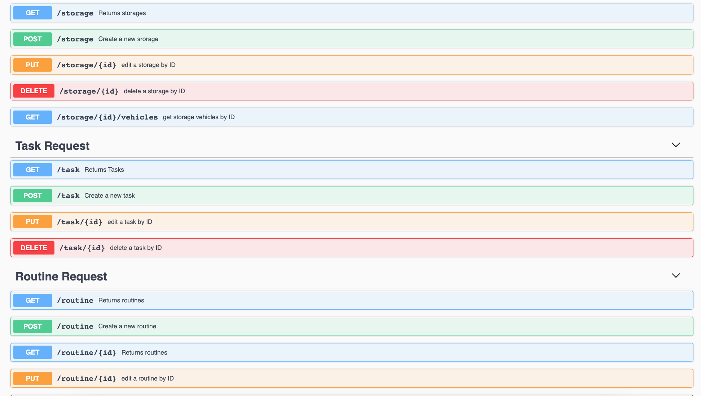

## DriveTech Backend Services 


### To Setup and Start
```bash
pip install -r requirements.txt 
python app.py
```

### Get All Storage Records
```bash
curl -X GET http://127.0.0.1:5000/storage
```

## Swagger UI


Hosted Locally
http://127.0.0.1:5000/swagger/
